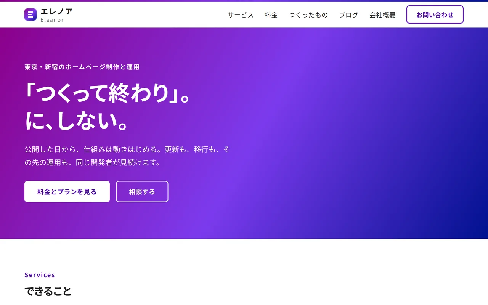
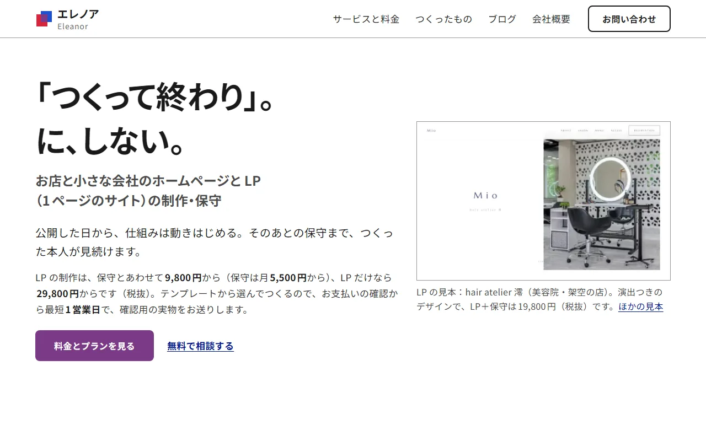

# 「AIっぽい」と言われるサイトの型と、このサイトで外したこと

エレノアのサイトを、1ページの LP の形から、サービス・料金・つくったもの・ブログ・会社概要に分けたホームページの形に作り直しました。最初に仕上がった版を代表として見たとき、生成 AI が作ったページによくある見た目だと感じました。勘で直すと、別の流行りの型に乗り換えるだけになります。そこで先に「何が AI っぽく見えるのか」を出典つきで調べ、当てはまったものを外していきました。

<!-- toc -->

## 最初の版で当てはまっていた型

最初の版のトップページです。当てはまっていた型は、次のとおりです。

- 紫から青への斜めのグラデーションで、ファーストビューの帯とロゴと共有用の画像を塗っていた
- 見出しの上に、字間を広げた英字の小見出しがトップページだけで 8 か所あった
- 同じ大きさと同じ角丸のカードに、紫の帯を付けて並べていた
- 制作物の画面や写真が、サイト全体で 1 枚もなかった
- 看板の下の文に「更新も、移行も、その先の運用も」という三つ並べがあった

読みやすさの決まりは、デジタル庁デザインシステムに沿って守れていました。文字の大きさ、行の間隔、色の明るさの比といった数字の部分です。それでも、面の塗り方と部品の並べ方が、よくある型のままでした。

## 調べたもの

- Claude を開発している Anthropic は、指示のない生成では「白地に紫のグラデーション」のような見た目に寄りやすい、と公式のブログで書いています（[Improving frontend design through skills](https://claude.com/blog/improving-frontend-design-through-skills)）。
- CSS の部品集 Tailwind CSS の作者は、既定のボタンの色を藍色にしたことが、AI が作る画面がみんな藍色になった一因だと書いています（[本人の投稿](https://x.com/adamwathan/status/1953510802159219096)）。
- 国内外のデザインの記事でも、紫から青へのグラデーション、同じ形のカードの繰り返し、実物のない主張が、目印として挙げられています（[925 Studios](https://www.925studios.co/blog/ai-slop-design-tells)、[Qiita の記事](https://qiita.com/kenimo49/items/8aaa2bf0d25c704637ae)）。
- 人の写真はプロフィールの文章より長く見られ、どこにでもある素材写真は読み飛ばされる、という調査もあります（[Nielsen Norman Group](https://www.nngroup.com/articles/photos-as-web-content/)）。

調べて分かったことがもう1つあります。エレノアのブランドの紫 `#7c3aed` は、Tailwind CSS の既定の色（violet-600）とまったく同じ値でした。紫という色そのものより、既定の色のまま面をグラデーションで塗る使い方のほうが、目印になっていました。

## 変えたこと

直したあとのトップページです。変えたことを、場所ごとに書きます。

### 色は、押すところと今いる場所にだけ

面は白と墨にしました。紫を使うのは、塗りのボタン、メニューで今いるページを示す下線、ロゴの印の 3 か所だけです。「赤と青が混ざって紫になる」というブランドの考えは、ロゴの印（赤と青の四角が重なり、重なった部分が紫）だけで表しています。

### 見出しにだけ、書体を1つ足す

Windows 11 の既定の書体は Noto Sans JP なので、OS の書体だけで組むと、どのサイトとも同じ顔になります。見出しとロゴにだけ Zen Kaku Gothic New を使い、このサイトで使っている字（約350字）だけを切り出して、自分のサイトから配っています。大きさは約 40KB です。この書体には字を詰めるための情報が入っていないので、見出しは詰めずに組み、看板の括弧だけを手で詰めました。

### 実物と数字を、最初の画面に

トップページの右側に、自分で運営している解約手帳の画面を、パソコンとスマートフォンの 2 枚で載せました。撮影した日も書いています。看板のすぐ下には、LP の料金、最短の日数、保守の月額を数字で書きました。数字は料金のデータから入れているので、料金を変えれば表示も一緒に変わります。

### 節ごとに形を変える

主力の LP の制作を大きく、ホームページの制作と保守を右に小さく置きました。料金は表、制作の流れは日数つきの時系列、つくったものは事実の表にしています。角丸は、ボタンと入力欄の 8px、文中のコードの 4px、角を丸めない表や画像、の 3 段だけです。

### よくある質問は開いたまま

折りたたみの中に入れた答えは、検索や AI の回答に拾われにくい、と Microsoft の広告部門が案内しています（2025年10月）。サービスのページのよくある質問は、質問と答えを開いたまま並べました。保守をやめるときの条件と、対応している地域の質問も足しています。

## 型が戻らないように、公開の前に止める

見た目は、手を入れているうちに少しずつ元の型へ戻ります。そこで、ビルドの最後に出力を調べ、次のものが入っていたら公開の手前で止めるようにしました。

- グラデーション（表の横スクロールを知らせる端の影だけは使ってよい）
- 見出しの上の英字だけの小見出しと、やめた部品の名前
- 決めた 3 段以外の角丸と、飾りの影
- 塗りのボタンと今いる場所とロゴ以外での紫
- 本文のダッシュ

「〜ではない」の対句や三つ並べのような文章の型は、警告だけ出して、書き直すかどうかを人が決めます。

## URL と料金の仕組みは変えていない

外からリンクされている URL（お支払いのあとの画面、アプリストアの掲載情報、配布済みのアプリ）は1つも変えず、公開のたびに全部そろっているかを確かめています。料金は1か所のデータから、料金表と特定商取引法に基づく表示の両方をつくっています。配信先は Cloudflare に移しました。GitHub Pages の規約は、商取引を主な目的とするサイトの無料の配信を認めていないためです。

## お店のサイトで使えること

お店のサイトでも、店内や商品の実際の写真と、料金と日数の数字を最初の画面に置くと、同じように信頼の材料になります。よくある質問は、答えまで開いて書いておくと、検索にも AI の回答にも拾われやすくなります。

サイトの見直しや引っ越しのご相談は、[お問い合わせ](/#contact)からどうぞ。
